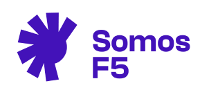
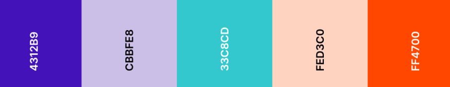

###### Factoría F5 / Somos F5




***

## 💻 Tabla de Contenidos
1. [Información General](#información-general)
2. [Capturas de Pantalla](#capturas-de-pantalla)
3. [Características técnicas de diseño](#🎨-características-técnicas-de-diseño)
4. [Tecnologías](#🛠️-tecnologías)
5. [Instalación](#instalación)
6. [Hoja de ruta](#hoja-de-ruta)
7. [Enlaces de interés](#🔗-enlaces-de-interés)
8. [Contacto](#🤝-contacto)

***
## ℹ️ Información General

**Somos F5** es una web interna, para el fichaje de horario laboral de los trabajadores de Factoria F5

*Proyecto en proceso de desarrollo*   

## 📋 [Presentación del proyecto](https://www.canva.com/design/DAFNi5OKi_w/7oM3yrKq2Um6uIjQ2tPPAQ/view?utm_content=DAFNi5OKi_w&utm_campaign=designshare&utm_medium=link&utm_source=publishsharelink)

***

## 🖼️ Captura de pantalla


***
## 🎨 Características técnicas de diseño 
### Gama de colores: 



### Fuente de letra: 
- Poppins


***

## 🛠️ Tecnologías
Lista de tecnologías utilizadas en el desarrollo del proyecto:
* React js. (18.2)
* Axios (0.27.2)
* Tailwind
* Firebase (Autenticación y Database)

***

## 🚀 Instalación

1.  Ingresar en Visual Studio Code
2.  Clonar el proyecto con el comando: 

 ``` 
git clone https://github.com/carolineromero/proyectoFinalF5.git
```

3. Abrir otra terminal e instalar las dependencias:
 ``` 
npm i
```

4. Ejecutar el siguiente comando, para abrir en el navegador
 ``` 
npm start
```
***
## 🗺️ Hoja de ruta

En esta primera entrega, presentamos una web responsive. Donde lo primero que se puede ver es un login funcional, que solo deja acceder si los datos coinciden con los de la base de datos.

Dependiendo de quien ingrese en la web, la página Home, dará un saludo u otro, y se podrá acceder al perfil del trabajado loggeado.

En Home se puede 

En futuras actualizaciones las features a realizar son:

* 
* 
* 
* 
* 
* Testing


## 🔗 Enlaces de interés

* [Prototipo figma](https://www.figma.com/file/jetl8b4oaoR1oBQNa2jWFT/Something-is-Cooking?node-id=0%3A1)  
* [Proyecto web](https://somethingiscooking.netlify.app/)

## 🤝 Autoras

<!-- ALL-CONTRIBUTORS-LIST:START - Do not remove or modify this section -->
<!-- prettier-ignore-start -->
<!-- markdownlint-disable -->
<table>
  <tr>
    <td align="center"><a href="https://github.com/CarmenVidal"><br /><sub><b>Carmen Vidal</b></sub></a><br /><a href="https://www.linkedin.com/in/carmen-vidal-teran/" <a href="" target="blank"></a> </td>
    <td align="center"><a href="https://github.com/carolineromero"><br /><sub><b>Carolina Romero</b></sub></a><br /><a href="https://www.linkedin.com/in/carolinaroomero/" <a href="https://linkedin.com/in/carolinaroomero" target="blank"></a> </td>
    <td align="center"><a href="https://github.com/Dweina1920"><br /><sub><b>Dina Yamani</b></sub></a><br /><a href="https://www.linkedin.com/in/dina-yamani/" <a href="https://www.linkedin.com/in/dina-yamani/" target="blank"></a> </td>
    <td align="center"><a href="https://github.com/RABIAZEEM"><br /><sub><b>Rabia Azeem</b></sub></a><br /><a href="https://www.linkedin.com/in/rabiaazeem/" <a href="https://www.linkedin.com/in/rabiaazeem/" target="blank"></a> </td>
    <td align="center"><a href="https://github.com/gilsusana"><br /><sub><b>Susana Gil</b></sub></a><br /><a href="https://www.linkedin.com/in/susanagildeveloper/" <a href="https://www.linkedin.com/in/susanagildeveloper/" target="blank"></a></td>
  </tr>
  </table>


  